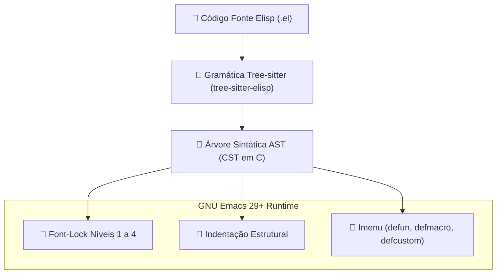

# 🌳 emacs-lisp-ts-mode

> Major mode moderno baseado no motor nativo Tree-sitter do GNU Emacs para edição, análise sintática e font-lock de programas em Emacs Lisp.

[](https://github.com/GabrielFrigo4/environment)
[](https://www.gnu.org/software/emacs/)
[](https://tree-sitter.github.io/)
[](emacs-lisp-ts-mode.el)
[](LICENSE)

---

## 🧭 Visão Geral

O **`emacs-lisp-ts-mode`** é uma reimplementação do tradicional `emacs-lisp-mode` construída sobre a API nativa de **Tree-sitter** introduzida no GNU Emacs 29.1. Em vez de depender de heurísticas e expressões regulares frágeis para colorização e navegação de código, o modo opera sobre uma **Árvore de Sintaxe Abstrata Concreta (CST)** gerada em tempo real pela gramática formal do Elisp.

### ✨ Principais Benefícios

- **Precisão Cirúrgica de Font-Lock:** Destaca formas especiais (`defun`, `defvar`, `defcustom`, `lambda`), macros, docstrings, parâmetros formais e chamadas com granularidade impossível via regex clássico.
- **Performance Incremental:** Reavaliação sintática assíncrona O(1) mesmo em buffers com dezenas de milhares de linhas de Elisp.
- **Navegação Semântica Estruturada:** Suporte a saltos sintáticos nativos baseados nos nós da AST (`treesit-beginning-of-defun`, `treesit-end-of-defun`).
- **Resiliência a Código Mal-Formatado:** O analisador Tree-sitter é tolerante a erros e continua colorizando o buffer mesmo com parênteses desbalanceados durante a digitação.

---

## 🏗️ Arquitetura de Parsing



---

## 📦 1. Instalação da Gramática Tree-sitter

Para que o motor Tree-sitter processe o Emacs Lisp, a gramática compilada [tree-sitter-elisp](https://github.com/Wilfred/tree-sitter-elisp) deve estar presente no seu sistema:

### Opção A: Instalação Automática via Emacs

Adicione a fonte da gramática à sua configuração:

```elisp
(add-to-list 'treesit-language-source-alist
             '(elisp "https://github.com/Wilfred/tree-sitter-elisp"))
```

Em seguida, execute no Emacs:

```text
M-x treesit-install-language-grammar RET elisp RET
```

---

## 🚀 2. Instalação do Pacote

### Modo Local / Git Submodule (Recomendado no Ecossistema)

Se você utiliza o **Universal Environment** ou o **GNU Emacs Hub**:

```sh
# Dentro do diretório ~/.emacs.d/usr/local/
git submodule add https://github.com/GabrielFrigo4/emacs-lisp-ts-mode.git usr/local/emacs-lisp-ts-mode
```

No seu `init.el`:

```elisp
(add-to-list 'load-path (expand-file-name "usr/local/emacs-lisp-ts-mode" user-emacs-directory))
(require 'emacs-lisp-ts-mode)
```

---

### Via Elpaca

```elisp
(use-package emacs-lisp-ts-mode
  :ensure (:type git :host github :repo "GabrielFrigo4/emacs-lisp-ts-mode")
  :mode "\\.el\\'")
```

---

### Via Quelpa

```elisp
(use-package emacs-lisp-ts-mode
  :quelpa (emacs-lisp-ts-mode :fetcher github :repo "GabrielFrigo4/emacs-lisp-ts-mode")
  :mode "\\.el\\'")
```

---

## ⚙️ Configuração Recomendada

Para substituir transparentemente o `emacs-lisp-mode` tradicional pelo `emacs-lisp-ts-mode`:

```elisp
(use-package emacs-lisp-ts-mode
  :ensure nil
  :mode "\\.el\\'"
  :init
  ;; Configura nível máximo de detalhes de font-lock (1 a 4)
  (setq treesit-font-lock-level 4))
```

Se você utiliza `major-mode-remap-alist`:

```elisp
(add-to-list 'major-mode-remap-alist '(emacs-lisp-mode . emacs-lisp-ts-mode))
```

---

## ⌨️ Recursos & Funcionalidades

| Recurso                 | Detalhes                                                                                |
| :---------------------- | :-------------------------------------------------------------------------------------- |
| **Docstrings**          | Destaque contextual de docstrings e argumentos referenciados (`\`ARG\``)                |
| **Special Forms**       | Cores dedicadas para formas de controle de fluxo e definição                            |
| **Quoting & Backquote** | Identificação clara de formas quasiquote e splicing                                     |
| **Imenu Automático**    | Indexação de funções (`defun`), macros (`defmacro`) e variáveis (`defvar`, `defcustom`) |

---

## 📄 Licença & Créditos

- **Autor & Mantenedor:** [Gabriel Frigo](https://github.com/GabrielFrigo4)
- **Gramática Elisp:** [Wilfred Hughes (tree-sitter-elisp)](https://github.com/Wilfred/tree-sitter-elisp)
- **Licença:** MIT License — Consulte o arquivo [LICENSE](LICENSE) para mais detalhes.
